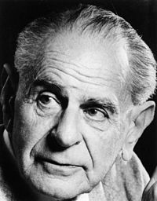

Module 1: Introduction to biostatistics and data analysis
====================================================

What is biostatistics? 
==================================================

In some biomedical studies we are seeking to describe the world. The fundamental act in these studies is one of measurement, with measurement of some sample of the population meant to stand in for a complete census.

* What is the expected age of menarche for caucasian girls in the United States? Has that age changed over the last 100 years?
* What mutations are most frequently found in adenocarcinoma of the lung?
* Which proteins bind to BRCA1 in MCF7 cells?

In some biomedical studies we seek to provide evidence supporting a hypothesis about a causal relationship. We will discuss causal analysis briefly in philosophical and practical terms, but for now it is enough to state that we are often interested in causes and effects. The basic problem is one of reverse-engineering: how do complex organic systems that were not designed by humans function? How can we modify those systems? The fundamental act in these studies is one of *comparison*:

* Does a rare mutation cause skin cancer?
* Is a strain of influenza resistant to a particular antibiotic?
* Is a new drug superior in effect to the current standard of care?

Identifying causes in biomedical research requires an intervention of some kind. Sometimes these interventions are controlled and artificial, as in a laboratory study or a randomized controlled trial. Sometimes they are natural experiments, observed in uncontrolled populations. Natural, organic systems do not behave identically in response to every intervention. Samples of individuals that vary will produce different measurements. Through repeated testing of the system, we attempt to identify consistent models that explain what we observe and predict responses to new interventions.

Biostatistics is the primary tool used to assess the key questions related to these studies: 

* How should I design an experiment that is likely to produce an informative result?
* How can I summarize the data I have collected?
* Do the values of measurements I have made have a relationship suggesting they are associated with each other?
* Did an intervention have an effect?
* What what was the size of that effect?
* How does the result of my experiment affect the evidence that a particular model is likely to be true?

Types of studies
==================================================

Observational 
-------------------

* cohort
* case-control
* screens

Interventional 
-------------------

Causal reasoning stems from interventions

* One or more interventions, other variables held constant
* Bench studies
* Randomized Controlled Trial 

Comparison between groups

* Role of a placebo or control
* variables
* Uncontrolled sources of influence: confounding

Continuum: strictly planned hypothesis testing to hypothesis generating

The scientific method and proof
=================================================

Can we prove a hypothesis to be true?
------------------------------------------------------

What does it mean to prove a biological hypothesis to be true? Is experimental research investigating the natural world similar in a strong sense to what mathematicians do? 

If pressed, we might say we’re trying to identify correct models for how biological systems work. 

Thinking about what it means to prove a fact, and whether it is even possible to establish a claim about the natural world to be true, is a problem that philosophers have been struggling with for centuries. That might seem rather far removed from the day to day concerns of a molecular biologist or clinical researcher, but there are good reasons to spend some time with these ideas. 

The first, fundamental reason for considering this issue is that thinking carefully about what it means to prove a fact to be true, and considering that it might not be possible to do so, has deep implications for how we think about what we are doing day to day. It affects how we talk and think about study designs, and how we think about interpreting results. 

The second, practical issue is that grappling with this issue is the only way to understand what a *P* value is. Many experimental scientists work with *P* values, and it is safe to say that many of those scientists don’t have a clear understanding of what a *P* value actually is. They know it’s good when *P* values are low, and that they give some information about whether a result would be seen by chance. The idea behind the *P* value, and therefore behind much of a biomedical researcher’s relationship to quantitative measures of an experiment, remains somewhat counterintuitive. It takes practice before it becomes second nature.

One formulation for the general process of the scientific method is that we make specific observations and then generalize these observations into models and even into laws. Some philosophers, such as David Hume, had a fundamental concern with this. We can think about their concern using a simple example. If we visit a lake crowded with birds day after day and only ever observe white swans, we may be tempted to make the induction that all swans are white. What, however, is our assurance that there is no such creature as a black swan? Unlike mathematics, where one can define axioms and create a completely consistent world from those axioms, natural phenomena are not created by our hands. Since the color of swans is determined by our experience in nature and not an internally consistent logical system derived from axioms, how could we ever formally prove a fact to be true about the world? It takes only a single black swan to invalidate the hypothesis, and there may always be a black swan hiding around the corner. 

Can we prove a hypothesis to be false?
------------------------------------------------------

Along came Karl Popper. Popper was a philosopher of science who grappled with this problem. One of his best-known tenets is that in order to qualify as a scientific inquiry, **“it must be possible for an empirical scientific system to be refuted by experience”** (*The Logic of Scientific Discovery*). By this formulation, a statement that cannot be proved false—that is not falsifiable, to use the jargon--  is not a scientific statement. Popper argued that we cannot prove a hypothesis about the natural world to be true in a deep, formal sense. What we can do, in place of that, is to prove that a statement cannot be true. The existence of a single black swan disproves the idea that all swans are white. This idea—that we can prove a hypothesis to be false, but not to be true—is important because it is a powerful formulation of what we are doing as scientists. It is also how the null hypothesis statistial testing works. One reason this is counterintuitive is that we generally don’t think of ourselves as proving things to be false.

As a practical example, we might hypothesize in the laboratory that treating cells in culture with olaparib, a drug that inhibits activity of the protein PARP, would selectively kill cells that cannot make the protein BRCA1. As a test, we treat those cells with olaparib and with a control that contains no PARP inhibitor. We then measure the effect on cells treated with either drug or control and make a judgement about the accuracy of our hypothesis. 

From a statistical and formal point of view, after stating our hypothesis that the intervention of olaparib will cause an effect, we then test a different hypothesis: **that there is no such effect**. We say, “if this model were false, then I would expect treating the cells with drug to have no effect. I’ll test the hypothesis that treatment has no effect. If I see an effect, my hypothesis is not supported.” This may seem like a strange way to go about things, but it is a natural consequence of the idea that we cannot positively prove the presence of an effect. In the jargon of statistics, the hypothesis that no effect is present is called the null hypothesis.

Measurements of events that take place in the natural world are not identical, due to real biologial variation and the imperfections in our instruments. The effect of our drug treatment is therefore a variable, and a very practical use of statistics is to answer the question, what is the strength of evidence against our negative or null hypothesis? The P value is one way to answer that question.

Role of statistics in planning studies
========================================================

Coping with variability

* Biological variation in organisms
* Variation in sample subsets (intuition for CLT, law of large numbers)
* Random error in measurements

Typical steps in data analysis
==================================================

Cultural conventions in biology vs. statistics
========================================================

In addition to the obvious differences in the working process of statisticians and biomedical researchers, there are less obvious cultural differences in how these two groups are trained and work. Although these differences are not absolute, they are worth bearing in mind:

**Statistical training**

Statistical training places an emphasis on formal methods and analytical rigor. Statistical methods are developed in a framework made by humans. Applying newly developed methods to real data is important but in many ways secondary to formal proofs of correctness. Statistical training makes extensive use of simulation during methods development. A typical statistical talk introduces a problem, describes earlier work in the area, explains the approach, shows mathematical justification for that approach, shows how the analysis is applied to simulated data, and then applies the approach to a data set from the natural world. Statistical analysis can generally be repeated with relatively little cost.

Some statisticians are intensely mathematical and rarely are exposed to the details of the domains where their work is applied, while others work routinely on applied problems and have extensive domain knowledge. 

**Biological training**

Biological research is relentlessly empirical. Biologists and epidemiologists are reverse-engineering systems made by evolution. Experiments are often expensive in time and money, and as a result biologists tend to want to wring every possible piece of information out of their work. Biological research is often motivated in part by intuition and a "feel for the organism", rather than formal logic. 

